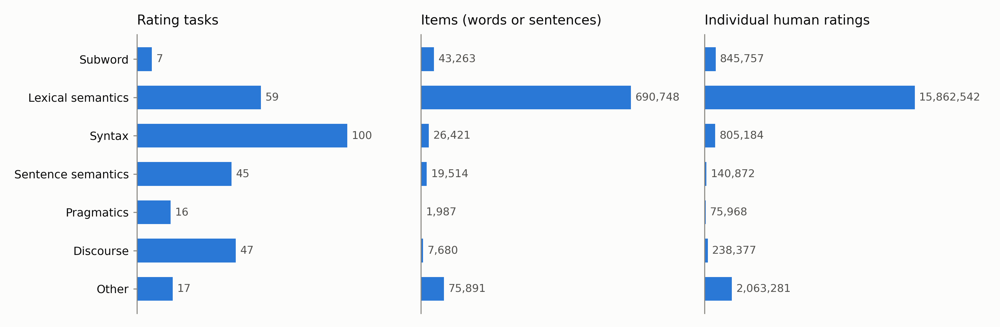
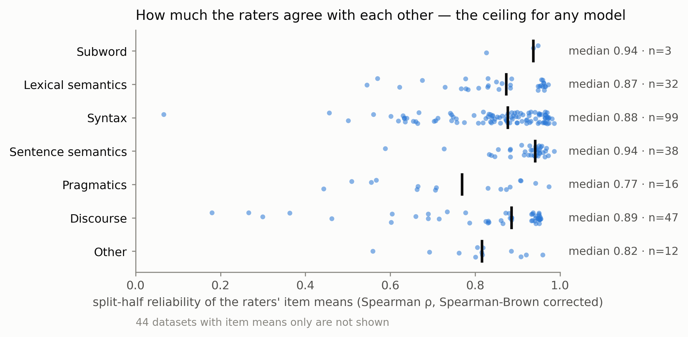
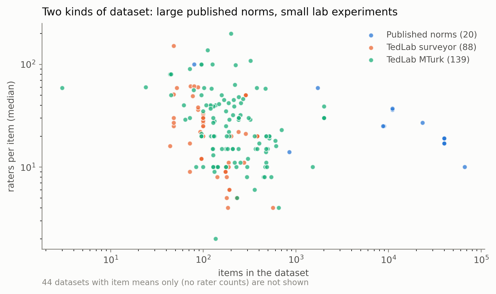

# metadata/

What the human data looks like. Generated by `pipeline/build_metadata.py` from
`data/*/*/metadata.json`; do not edit by hand.

- `catalog.csv` — one row per dataset: level, source, size, scale, split-half
  reliability, who decided the level and why.
- `fig_levels` — tasks, items and ratings per level.
- `fig_reliability` — the raters' split-half reliability per level, the ceiling
  any model-human correlation can reach.
- `fig_size` — items × raters per item, one dot per dataset.

## Headline numbers

**291 rating tasks** across 7 levels, **865,504 items** (words or sentences × property), **20,031,981 individual human ratings**.
Human data is reliable: median split-half **ρ = 0.89** (Spearman-Brown corrected; Pearson r = 0.91) over the 247 tasks with individual responses.

### By level

| level | tasks | items | ratings | items / task (median) | raters / item (median) | median reliability ρ |
|---|--:|--:|--:|--:|--:|--:|
| Subword | 7 | 43,263 | 845,757 | 1500 | 50 | 0.94 (n=3) |
| Lexical semantics | 59 | 690,748 | 15,862,542 | 2020 | 30 | 0.87 (n=32) |
| Syntax | 100 | 26,421 | 805,184 | 196 | 20 | 0.88 (n=99) |
| Sentence semantics | 45 | 19,514 | 140,872 | 100 | 30 | 0.94 (n=38) |
| Pragmatics | 16 | 1,987 | 75,968 | 96 | 34 | 0.77 (n=16) |
| Discourse | 47 | 7,680 | 238,377 | 100 | 20 | 0.89 (n=47) |
| Other | 17 | 75,891 | 2,063,281 | 2000 | 30 | 0.82 (n=12) |

### By source

| source | tasks | items | ratings | with individual ratings |
|---|--:|--:|--:|--:|
| Published norms | 64 | 802,508 | 17,996,983 | 20 |
| TedLab surveyor | 88 | 12,546 | 330,886 | 88 |
| TedLab MTurk | 139 | 50,450 | 1,704,112 | 139 |

## Figures

## Reliability, defined

For each dataset with individual ratings, the raters of every item are split at
random into two halves; the two halves' item means are correlated across items
(Pearson and Spearman) and Spearman-Brown corrected, 2r/(1+r), to estimate the
reliability of the full sample. The median over 100 random splits is kept.
Same definition as Diba's summer 2026 catalog (`archive/presentation_2026_summer`).
A model's rank correlation with the human means cannot be expected to exceed
the Spearman value; the Item Inspector shows it as the human ceiling.
